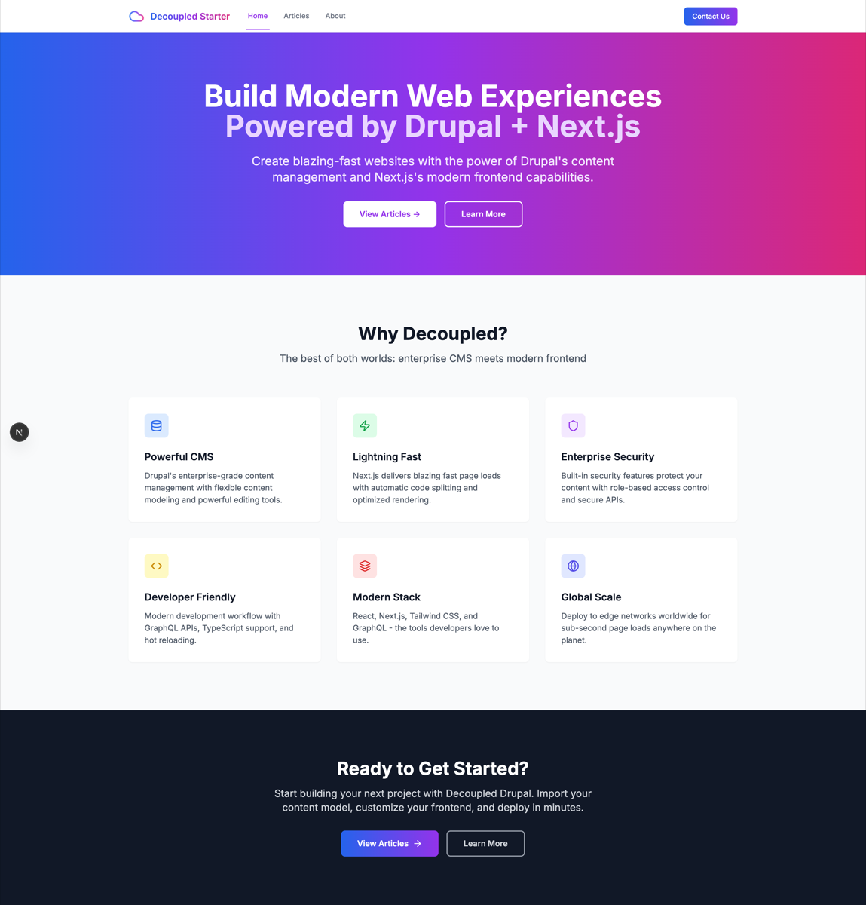

# Decoupled Veterinary

A veterinary clinic website starter template for Decoupled Drupal + Next.js. Built for veterinary practices, animal hospitals, pet clinics, and specialty animal care providers.



## Features

- **Services** - Showcase veterinary services with pet type compatibility, summaries, and categories
- **Provider Profiles** - Veterinarian and staff bios with credentials, specialties, education, and patient availability
- **Pet Resources** - Educational articles for pet owners with categories, pet types, and author attribution
- **Static Pages** - About, emergency care info, and other content pages
- **Modern Design** - Clean, accessible UI optimized for veterinary and pet care content

## Quick Start

### 1. Clone the template

```bash
npx degit nextagencyio/decoupled-veterinary my-vet-clinic
cd my-vet-clinic
npm install
```

### 2. Run interactive setup

```bash
npm run setup
```

This interactive script will:
- Authenticate with Decoupled.io (opens browser)
- Create a new Drupal space
- Wait for provisioning (~90 seconds)
- Configure your `.env.local` file
- Import sample content

### 3. Start development

```bash
npm run dev
```

Visit [http://localhost:3000](http://localhost:3000)

---

## Manual Setup

If you prefer to run each step manually:

<details>
<summary>Click to expand manual setup steps</summary>

### Authenticate with Decoupled.io

```bash
npx decoupled-cli@latest auth login
```

### Create a Drupal space

```bash
npx decoupled-cli@latest spaces create "My Vet Clinic"
```

Note the space ID returned. Wait ~90 seconds for provisioning.

### Configure environment

```bash
npx decoupled-cli@latest spaces env 1234 --write .env.local
```

### Import content

```bash
npm run setup-content
```

This imports:
- Homepage with hero, stats (20,000+ pets treated, 18 years, 15 team members, 4.9 rating), and appointment CTA
- 3 services: Wellness Exams & Vaccinations, Surgical Services, Pet Dental Care
- 3 providers: Dr. Sofia Martinez (Internal Medicine), Dr. Emeka Okafor (Surgery), Dr. Yuki Tanaka (Exotic Animals)
- 3 pet resources: New Puppy Owner's Guide, Keeping Indoor Cats Happy, Summer Pet Safety Tips
- 2 static pages: About Pawsitive Care, Emergency & Urgent Care

</details>

## Content Types

### Service
- **image**: Service image
- **summary**: Brief service description
- **pet_types**: Compatible pet types (Dogs, Cats, Birds, Rabbits, etc.)
- **service_category**: Category taxonomy (Wellness & Prevention, Surgery, Dentistry, Diagnostics, etc.)

### Provider
- **image**: Portrait photo
- **credentials**: Professional credentials (e.g., "DVM, DACVS")
- **specialty**: Area of expertise
- **education**: Education background (rich text)
- **favorite_animals**: Favorite animals to work with
- **accepting_patients**: Whether accepting new patients (boolean)
- **provider_role**: Role taxonomy (Veterinarian, Veterinary Surgeon, Veterinary Technician, etc.)

### Pet Resource
- **image**: Featured image
- **summary**: Brief article summary
- **pet_type**: Applicable pet type taxonomy (Dogs, Cats, Birds, etc.)
- **resource_category**: Category taxonomy (Nutrition, Behavior, Health & Wellness, New Pet Owner, etc.)
- **author_name**: Article author
- **published_date**: Publication date

### Homepage
- **hero_title**: Main headline (e.g., "Compassionate Care for Your Best Friend")
- **hero_subtitle**: Clinic name tagline
- **hero_description**: Introductory paragraph
- **hero_image**: Hero background image
- **stats_items**: Key statistics (pets treated, years, team size, rating)
- **featured_items_title**: Section heading for featured services
- **cta_title / cta_description**: Appointment call-to-action block

### Basic Page
- General-purpose static content pages (About, Emergency, etc.)

## Customization

### Colors & Branding
Edit `tailwind.config.js` to customize colors, fonts, and spacing.

### Content Structure
Modify `data/veterinary-content.json` to add or change content types and sample content.

### Components
React components are in `app/components/`. Update them to match your design needs.

## Demo Mode

Demo mode allows you to showcase the application without connecting to a Drupal backend.

### Enable Demo Mode

```bash
NEXT_PUBLIC_DEMO_MODE=true
```

### Removing Demo Mode

1. Delete `lib/demo-mode.ts`
2. Delete `data/mock/` directory
3. Delete `app/components/DemoModeBanner.tsx`
4. Remove `DemoModeBanner` from `app/layout.tsx`
5. Remove demo mode checks from `app/api/graphql/route.ts`

## Deployment

### Vercel (Recommended)
[](https://vercel.com/new/clone?repository-url=https://github.com/nextagencyio/decoupled-veterinary)

### Other Platforms
Works with any Node.js hosting platform that supports Next.js.

## Documentation

- [Decoupled.io Docs](https://www.decoupled.io/docs)
- [Next.js Documentation](https://nextjs.org/docs)
- [Drupal GraphQL](https://www.decoupled.io/docs/graphql)

## License

MIT
